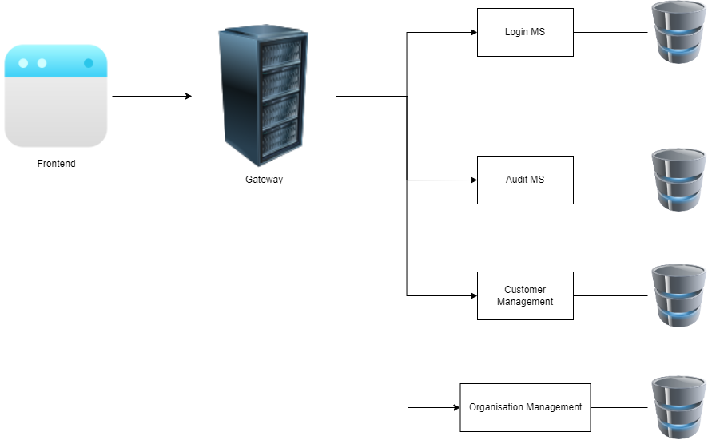

# Architecture

# Microservices

| Name  | Responsiblity  | Repository URL  |
|---|---|---|
|  User Management | Login users, Register Users, Create JWT Token, Validate JWT Token, Creating organization chart, defining roles, Ebenen und Gruppen verwalten, Firmen/Kunden verwalten |   |
| Audit  |  Audit functionality (Manage Audits, Questions, Answers etc.) |   |
| Tasks  |  Gathers tasks from all apps for a specific user, so frontend can display it in Frontend under "Aktuelle Aufgaben" (see Dashboard/page 2 of Mockup) |   |