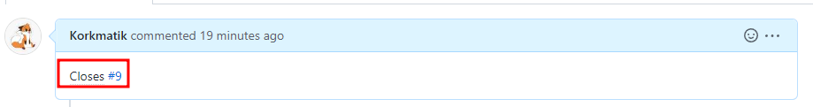

# Konvention

## Branches
Alle Branches müssen folgend benannt werden:
* `main`
* `<ISSUE-ID>-<ISSUE-TITLE>` (ohne Sonderzeichen, falls Issue Titel Sonderzeichen enthält)

### Main Branch
Es ist nichts direkt in den Main Branch zu commiten. Es sollte zuerst auf einem Issue Branch gearbeitet werden, um dann ein Merge Request/Pull Request in den Main Branch zu erstellen. Außnahmen dazu sind *Hotfixes*.

#### Hotfixes
Hotfixes sind Veränderungen am Code um gravierende Fehler (z.B. Sicherheitslücken) so schnell wie möglich zu schließen. Diese dürfen direkt in den Main Branch committet werden. Die Commit Message sollte wie folgt lauten: `HOTFIX: <beschreibung>`

## Commit Messages
- Commit Messages müssen in Englisch formuliert werden
- Commit Messages sollten in Präsenz formuliert werden
- Commit Messages sollten so kurz wie möglich formuliert werden
- Siehe Abschnitt Hotfixes für Commit Messages für Hotfixes

Bei Merges muss der Commit Message Titel `Merge pull request #<nummer vom pull request> from <repository>/<branch>` lauten (Dies wird automatisch in GitHub gesetzt, wenn man über die Web App merged).

## Pull Requests

### Titel
Titel des Issue *oder* eine kurze Beschreibung

### Inhalt
- Kurze Beschreibung der Änderungen, wenn das nicht über den Titel klar ist
- Sowie der folgende Satz: `Closes #<issue nummer>`, damit die Issue automatisiert mitgeschlossen wird beim mergen

## Issues

### Titel
- Kurze Zusammenfassung des Inhalts
- Keine Sonderzeichen wie z.B. `\/;+-*` enthalten (Ausnahme: `:`)

### Inhalt
Beschreibung, was das Ziel des Issues ist, wenn es aus dem Titel nicht klar ist

# Code Style
- Es wird in Englisch programmiert, sprich alle Variablen Namen und Kommentare sind in Englisch zu verfassen.
- Es gelten immer die Coding Guidelines, welches für das Repository festgelegt wurden. Siehe hierfür das Wiki des entsprechenden Repos oder nach einer "Conventions.md" im Code Repository. Im Zweifel fragt die Teammitglieder :)

### Python Coding Convention
- Grundsätzlich sollten die [PEP 8](https://www.python.org/dev/peps/pep-0008/) Guidelines befolgt werden

### JavaScript Coding Convention

### Typescript Coding Convention

# Ausnahmen
In jedem Repository können abweichende Guidelines definiert werden. Falls dem so ist, dann sollten die Guidelines im Wiki unter dem Punkt "Conventions" oder im Code Repo in einer Datei mit dem Namen "Conventions.md" dokumentiert sein.

# Verbesserungen & Änderungen
- Falls etwas nicht klar definiert ist, dann einfach Nachfragen geben. Wir bemühen uns, dies auszubessern.
- Wir nehmen gerne Verbesserungsvorschläge an
- Bei Änderungen von Konventionen sollen keine geschehenen Pull Requests, Issues, Commits etc. verändern werden.
