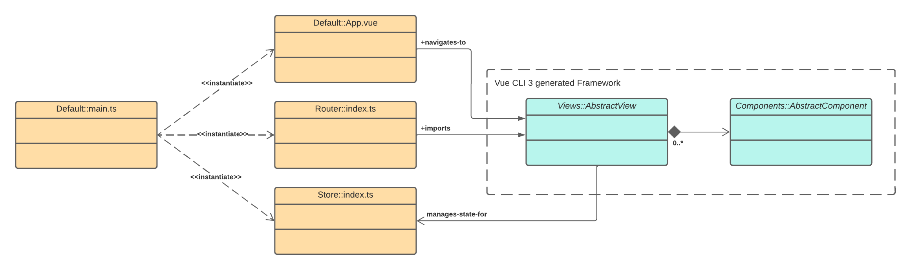

# Inhaltsverzeichnis
- [Technologien](#technologien)
- [Ressourcen](#ressourcen)
- [Architektur](#architektur)
  - [Ordnerstruktur](#ordnerstruktur)
  - [Namensstruktur](#namensstruktur)
  - [Modulare Architektur](#modulare-architektur)
- [Verzeichnisse](#verzeichnisse)
  - [Assets](#assets)
  - [Libraries](#libraries)
    - [Components](#app-components)
    - [Interfaces](#app-interfaces)
    - [Mixins](#app-mixins)
    - [Services](#app-services)
    - [Stores](#app-stores)
  - [Modules/LPA](#moduleslpa-module)
    - [Components](#lpa-components)
    - [Interfaces](#lpa-interfaces)
    - [Router](#lpa-router)
    - [Stores](#lpa-stores)
    - [Views](#lpa-views)
  - [Modules/Main](#modulesmain-module)
    - [Components](#main-components)
    - [Interfaces](#main-interfaces)
    - [Router](#main-router)
    - [Stores](#main-stores)
    - [Views](#main-views)
  - [Router](#übergeordneter-router)
- [Roadmap](#roadmap)

<br/><br/>

# Technologien
Wie haben die folgenden Technologien für unseren Frontend-Stack ausgewählt.

<br/><br/>

## Vite
Wir haben uns als Build Tool und Development Server für Vite entschieden, da damit die Entwicklung erheblich beschleunigt werden kann. Die Alternative dazu wäre die Vue CLI mit Webpack. Webpack hat allerdings den Nachteil, dass mit steigender Größe des Projektes auch der Entwicklungsserver immer langsamer wird und viel Zeit benötigt, um eine Änderung umzusetzen.

<br/><br/>

**Vorstellung von Webpack**<br />
Webpack ist ein Bundler, der alle Javascript-, Bild-, und CSS Dateien sammelt und zu größeren Einheiten kombiniert. Beispielsweise werden also zusammengehörende Hilfsmethoden aus verschiedenen Quelldateien in eine einzige große Javascript Datei zusammengefasst. Das verringert die Ladezeit, da statt vielen kleinen nur größere Dateien heruntergeladen werden müssen. Die Zeit, die benötigt wird um diese Bundles zu erstellen ist aber abhängig von der Anzahl der Dateien. Je größer das Projekt wird, desto länger dauert dieser Prozess. Beim Build (Production Version) ist das weniger schlimm, aber beim Entwickeln bremmst der Entwicklungsserver dadurch den Programmierer sehr aus. Wenn eine Datei geändert wird muss Webpack ganze Bundles aus vielen Dateien neu generieren.

<br/><br/>

**Warum wir Vite gewählt haben**<br />
Vite besteht im Grunde aus der gleichen Idee wie Webpack. Es soll ebenfalls die Entwicklung von JavaScript Projekten in der Entwicklungsversion beschleunigt und am Ende ein Produktiv-Build generiert werden. Vite ist darin aber wesentlich besser, da es auf neue Funktionen moderner Browser setzt. Beispielsweise werden Dynamic-Imports genutzt. Hier macht das Hot Module Replacement (also das sofortige Austauschen von geänderten Komponenten, ohne das ein Refresh des Browser notwendig ist) mehr Sinn, da der Programmierer nicht so lange waren muss, bis die Änderungen aktiv sind.

<br/><br/>

## Vuejs 3
Für das Erstellen von grafischen Oberflächen für Webanwendungen gibt es vor allem drei etablierte Frameworks. Angular, React und Vuejs. Neben diesen drei gibt es auch einige neue, modernere Ansätze wie Svelte und Solid. Diese sind allerdings aktuell noch in der Entstehungsphase und sind deshalb weniger geeignet für größere Webprojekte. Es gibt noch wenige Libraries und Hilfestellungen und deshalb haben wir uns gegen diese Frameworks entschieden. Zwischen Angular, React und Vuejs ist diese Entscheidung weniger einfach zu fällen. Letztendlich haben wir uns aber für Vuejs entschieden.

<br/><br/>

**Vergleich von Angular, React und Vuejs**<br />
Vuejs ist ein progressives Framework zur Entwicklung von grafischen Oberflächen. Progressiv bedeutet, dass man in Vuejs sehr klein starten kann. Man fügt erst einen kleinen Teil in ein Projekt ein und dieser kann dann organisch zu etwas immer größeren heranwachsen. React dagegen ist vergleichbar mit einer UI Library und Angular ist ein älteres, vollumfängliches Frontend-Framework.

<br/><br/>

| Kriterium | Angular | React | Vuejs |
|-----------------|-----------------|-----------------|-----------------|
| Architektur | Das originale Framework folgt dem MVC-Muster. In Angular 2 wurde diese strikte Architektur aber aufgeweicht und es kann ebenfalls komponentenbasiert gearbeitet werden. Projekte in Angular sind strukturiert nach Modules, Components und Services.  | React gibt keine spezielle Projektstruktur vor. Es kann auch als UI Library verwendet werden, um Elemente zu rendern und ist deshalb nicht zwingend ein striktes Framework. React ist in Elements und Components strukturiert. | Vuejs fokussiert sich nur auf die Views (Seiten). Als progressives Framework kann es dann erweitert werden zu einem vollumfänglichen Framework mit beispielsweise Vue Router zur Seitennavigation oder Vuex als Store zur seitenübergreifenden Datenhaltung. Darüber hinaus können auch Components definiert werden, die die Seiten aufbauen. Vuejs ist inspiriert nach dem MVVM-Muster. |
| Beliebtheit | Angular hat am wenigsten Sterne auf Github (über 60k) und wird von Google entwickelt. Es wird häufig in Unternehmensprojekten verwendet, allerdings nicht in einem der eigenen Flagschiffe von Google selbst. Angular ist das älteste Framework unter den dreien. | React ist eines der beliebtesten JavaScript Frameworks überhaupt (mit über 160k Sternen auf Github) und wird entwickelt und gepflegt von Facebook. Es wird intern bei Facebook für viele Produkte verwendet und ist vermutlich das am meisten genutze Framework unter den dreien. | Vuejs hat die meisten Sterne auf Github (über 170k) und ist ein freies und unabhängig entwickeltes Framework. Es wird von Evan You geführt, der zuvor bei Google an Angular mitgearbeitet hat. Es wird häufig in Projekten verwendet und wächst an Popularität. |
| Ökosystem | Durch die Etabliertheit von Angular gibt es wie auch bei React und Vuejs viele fertige Libraries. Es gibt beispielsweise auch offizielle Libraries von Google, die das Material Desing unterstützen. | Durch die Beliebtheit von React ist es nicht schwer, fertig nutzbare Libraries zu finden. Das Ecosystem von React umfasst auch React Native. Dieses erlaubt das Entwickeln von Android und IOS Projekten aus einer einzigen React Codebasis heraus. | Mittlerweile gibt es auch bei Vuejs viele fertige Libraries, die Entwicklunszeiten erheblich verkürzen können. Teilweise sind diese auch durch das Team hinter Vuejs erstellt worden und erweitern die Funktionalitäten des Progressive Frameworks. Darunter sind vor allem Vue Router, Vuex und Piniajs zu nennen. |
| Performance | Im Vergleich zu React und Vuejs ist Angular etwas langsamer. | React und Vuejs sind sehr vergleichbar bei der Performance. | React und Vuejs sind sehr vergleichbar bei der Performance. |
| Lernkurve | Angular hat unter den Dreien die komplexeste Projektstruktur. Da es ein vollständiges Frontend-Framework ist, ist es auch von mehr Konzepten abhängig. Darüber hinaus funktioniert Angular am Besten mit Typescript, was die Lernkurve auch erhöht. Darüber hinaus hat es eine ähnliche HTML Syntax wie auch Vuejs. Mit dieser muss man sich als Entwickler zuerst vertraut machen, danach ist diese aber sehr intuitiv. | In der einfachsten Version ist React am einfachsten zu lernen unter den Dreien, da es in diesem Fall nur eine UI Library ist. Allerdings verwenden viele Entwickler JSX, was die Lernkurve enorm erhöht. React basiert zwar auf JavaScript, wird aber meistens mit JSX (Javascript XML) kombiniert. | Das Aufsetzen von Vuejs ist etwas komplexer als bei React. Vuejs setzt wie Angular auf eine HTML Syntax die zuvor gelernt werden muss. Darüber hinaus ist aber die Syntax und der Projektaufbau von Vuejs einfacher und intuitiver für viele Entwickler. Deshalb hat Vuejs vermutlich die geringste Lernkurve. |
| Zukunftsvorhersage | Angular ist nach wie vor ein sehr beliebtes Projekt und wird nach wie vor in neuen Versionen weiterentwickelt. Es ist damit sehr unwahrscheinlich, dass es in naher Zukunft nicht mehr weitergepflegt wird. | React wurde am meisten heruntergeladen und ist damit sehr beliebt. Es wird aktiv weiterentwickelt und neue Versionen veröffentlicht. Das macht es sehr unwahrscheinlich, dass React in naher Zukunft nicht mehr weitergepflegt wird. | Mit Vuejs 3 wurden viele nützliche Funktionen aus React übernommen und das Framework wurde komplett in Typescript überarbeitet. Dadurch eignet es sich mittlerweile noch besser für große Projekte. Es wird in regelmäßigen Updates weiterentwickelt, ist beliebt und hat eine starke Community hinter sich. Das macht es sehr unwahrscheinlich, dass Vuejs in naher Zukunft nicht mehr weitergepflegt wird. Darüber hinaus wird es immer populärer und könnte bald Angular bei den Downloadzahlen überholen. |

<br/><br/>

**Warum wir Vuejs gewählt haben**<br />
Aus der Tabelle ist vor allem ersichtlich, dass diese drei Frameworks fast auf Augenhöhe sind und jedes der drei seine eigenen Vorteile hat. Alle drei Projekte werden sehr aktiv weiterentwickelt. Der Support ist bei allen dreien sehr hoch und man kann sowohl Angular, als auch React oder Vuejs sicher auswählen in großen und kleinen Projekten. Bevor man eines der Frameworks wählt muss man sich verschiedene Fragen stellen. Zum einen die Erfahrung des Entwicklerteams, zum anderen verfügbare Entwickler, die eingestellt werden könnten und nicht zuletzt die Art und Komplexität des Projektes, dass umgesetzt werden soll. Schlussendlich war für uns vor allem entscheidend, dass Vuejs aktuell immer mehr an Popularität gewinnt und wir uns bereits teilweise mit der Entwicklung von Vuejs Projekten auskannten. Vuejs ist einfach zu erlernen und kann allen unseren Anforderungen an die von HWH geplanten Plattform gerecht werden. Darüber hinaus haben wir uns für Vue Router zur Seitennavigation und Piniajs als Store entschieden.

<br/><br/>

## Piniajs
Wir haben uns zur Seiten- und Komponentenübergreifenden Datenhaltung gegen den Vuex Store und für Piniajs entschieden. Piniajs ist eine relativ neue Library und wird als die Weiterentwicklung von Vuex angesehen. Darüber hinaus konnte mit Piniajs die modulare Architektur der Anwendung einfacher umgesetzt werden. Pinia ist intuitiv zu nutzen und macht die Nutzung des Stores so einfach wie die Nutzung von Komponenten. Es wurde von Grund auf so aufgebaut, dass es modular verwendet werden kann beliebig erweitert werden um Konzepte wie Local Storage, Transaktionen oder Synchronisation. Pinijs ist ein kostenloses Open-Source-Framework das aktiv von Mitgliedern des Vuejs Core Teams weiterentwickelt wird. Das macht es sehr unwahrscheinlich, dass es in naher Zukunft nicht mehr weitergepflegt wird. Aus diesen Gründen haben wir uns für Piniajs entschieden.

<br/><br/>

## Typescript
Typescript ist eine kostenlose Erweiterung von Javascript und ergänzt dieses um ein statisches Typsystem. Dieses kann dazu beitragen, viele potenzielle Laufzeitfehler zu vermeiden. Das ist besonders dann hilfreich, wenn eine größere Applikation gebaut werden soll, an der viele verschiedene Entwickler arbeiten. Vue 3 ist standardmäßig bereits in Typescript geschrieben, ebenso wie Vue Router und Piniajs. Damit wird eine Typescript Entwicklung bestmöglich unterstützt. Aus diesen Gründen haben wir uns für die Verwendung von Typescript im Rahmen der Entwicklung der HWH Plattform entschieden. Typescript ist ein kostenloses Open-Source-Projekt und wird von Microsoft aktiv weiterentwickelt und gepflegt. Es ist ein sehr beliebtes Projekt und Javascript ist eine der populärsten Programmiersprachen, was es sehr unwahrscheinlich macht, dass es in naher Zukunft nicht mehr weitergepflegt wird.

<br/><br/>

## TailwindCSS
Ein UI-Framework kann die Entwicklungszeit einer Webapplikation erheblich beschleunigen, da fertige Komponenten und Styles verwendet werden können. Ein Beispiel hierfür ist das populäre Bootstrap. Dieses setzt aber auf fertig gestylte Komponenten. TailwindCSS dagegen ist ein Utility-First CSS Framework, dass sich lediglich um das Aussehen kümmert und sich gut für größere Projekte eignet. Je mehr ein Projekt wächst, desto schwieriger wird es, das Aussehen mit CSS zu organisieren. Die Performance einer oder vieler großer CSS Dateien ist schlecht und es ist nach einer Weile als Entwickler schwer nachzuvollziehen, was die einzelnen Klassen bedeuten. Besonders, wenn wir diese nicht selbst geschrieben haben. Hier versucht TailwindCSS Abhilfe zu schaffen. Der Programmierer muss sich keine Gedanken über sinnvolle Klassennamen machen und das geschriebene CSS wird auch nicht größer. Stattdessen werden fertig definierte Klassen von Tailwind genutzt. Darüber hinaus erleichtert Tailwind auch das Responsive Design, den Darkmode oder die Verwendung von States wie Hover. TailwindCSS verfolgt eine neue CSS Architektur, bei der auf einen komponierbaren Ansatz gesetzt wird. Man kann die einzelnen atomaren Klassen nahezu beliebig kombinieren und so jede gewünschte Funktionalität erreichen. Dabei ist entwicklerfreundlich direkt im HTML Code erkennbar, welche Klassen auf welches Element wirken. Beim Erstellen des Builds wird aber nur das CSS ausgeliefert, was auch tatsächlich verwendet wurde. So wird die Dateigröße von TailwindCSS im Vergleich mit vielen anderen CSS Bibliotheken nochmals reduziert. Darüber hinaus ist das kostenlose Open-Source-Framework sehr beliebt, wird regelmäßig weiterentwickelt und aktiv gepflegt. Das macht es sehr unwahrscheinlich, dass es in naher Zukunft nicht mehr weitergepflegt wird. Aus diesen Gründen haben wir uns für TailwindCSS entschieden.

<br/><br/>

## ApexCharts
Für die Erstellung von grafischen Analysen gibt es verschiedene Libraries. Wir haben einige verglichen und uns schlussendlich für ApexCharts entschieden. Dieses kann die Anforderungen an die HWH Plattform am besten umsetzen. Einige der Vorteile dieser Bibliothek sind die große Anzahl verschiedener Auswertungstypen, die hohe Personalisierbarkeit und das Responsive Design der Komponenten. ApexCharts kann sowohl in Angular, als auch React und Vuejs verwendet werden, es ist kostenlos und ein beliebtes Open-Source-Projekt. Darüber hinaus wird es auch durch neue Releases weiterenwickelt und wird aktiv gepflegt. Das macht es sehr unwahrscheinlich, dass ApexCharts in naher Zukunft nicht mehr weitergepflegt wird. Aus diesen Gründne haben wir uns für ApexCharts entschieden.

<br/><br/>

# Ressourcen
Gute Links und Quellen, um sich in die Architektur und die Technologien einzuarbeiten.

<br/><br/>

## Vuejs 3
* Eine gute Anlaufstelle ist die offizielle und gut gepflegte [Dokumentation](https://vuejs.org/guide/introduction.html) von Vuejs
* Hilfreich sind auch die kurzen [Anleitungen](https://vueschool.io/) und Videos der Vue School
* [Tipps](https://vueschool.io/articles/vuejs-tutorials/how-to-structure-a-large-scale-vue-js-application/) für große Vuejs Projekte
* [Artikel](https://athemes.com/guides/angular-vs-react-vs-vue/) zu den Unterschieden zwischen Vuejs, Angular und React
* Dokumentation zu [Vue Router](https://router.vuejs.org/) und [Piniajs](https://pinia.vuejs.org/)
* [Artikel](https://www.heise.de/hintergrund/Vite-js-Rasantes-Build-Tool-aus-der-Vue-js-Schmiede-5060920.html?seite=all) mit Gründen für Vite und [Dokumentation](https://vitejs.dev/guide/why.html) von Vite

<br/><br/>

## TailwindCSS
* Hilfreiche [Dokumentation](https://tailwindcss.com/docs/installation) zu TailwindCSS und CSS Klassen
* Fertige [UI-Komponenten](https://tailwindui.com/components) für Vuejs von TailwindCSS
* [Video](https://www.youtube.com/watch?v=oMOe_32M6ss) mit Informationen zum Darkmode von TailwindCSS

<br/><br/>

## Weitere Links
* [Buch](https://books.google.de/books/about/Layered_Process_Audit_LPA.html?id=5bhPAgAAQBAJ&redir_esc=y) und [Website](https://www.qz-online.de/a/grundlagenartikel/layered-process-audit-316817) mit Informationen zu Layered Process Audits
* Offizielle [Dokumentation](https://www.youtube.com/watch?v=iuyzO2QkY7A) mit nützlichen Informationen zu ApexCharts
* [Video](https://www.youtube.com/watch?v=iuyzO2QkY7A) mit einem Beispiel zur modularen Architektur

<br/><br/>

# Architektur
Die folgende Architektur soll das Frontend sinnvoll für ein größeres Projekt strukturieren und so die Erweiterbarkeit und Übersichtlichkeit erhöhen. Dazu wird neben der Architektur auch die verwendete Ordnerstruktur vorgestellt und einige Namenskonventionen festgelegt.

<br/><br/>

## Ordnerstruktur
Die Ordnerstruktur soll sich stark an der Standardstruktur für Vue/CLI generierte Projekte orientieren. Dadurch ist das Projekt leichter nachvollziehbar.
* `assets` Enthält notwendige Dateien wie Bilder
* `components` Enthält sinnvolle Komponenten für eine gute Wiederverwendbarkeit
* `router` Enthält die Seitennavigation
* `store` Enthält seitenübergreifende Daten
* `views` Enthält die Seiten

<br/><br/>

## Namensstruktur
Raphi

<br/><br/>

## Modulare Architektur



<br/><br/>

### Module registrieren

<br/><br/>

# Verzeichnisse

## Assets
In den Assets werden derzeit alle verwendeten Icons und Bilder gespeichert.
Die Icons sind in der entsprechenden Library eingefügt und sind nur für den Wiedergebrauch zusätzlich abgelegt. Das Login-Bild sollte in Zukunft aus dem Backend kommen und kann auf die nutzende Firma angepasst werden.

<br/><br/>

## Libraries
### App Components
#### Import von Komponenten
Mit dem folgenden Import können die einzelnen Komponenten aus der übergeordneten Library in den Komponenten und Seiten der Module installiert werden. Im Anschluss werden die Funktionen der einzelnen Komponenten und ihre `Props` und `Emits` näher beschrieben.
```ts
import {AppButtonPrimary, AppButtonSecondary, AppButtonTertiary} from "./libraries/components"
```
<br/><br/>

#### Registrieren von Komponenten
Im Folgenden wird beschrieben, wie neue Komponenten in der Library registriert werden können.
<br/><br/>

#### Inhaltsverzeichnis
**Button**<br />
Ein Button ist eine Komponente, die eine Call to Action (oder einen Link, aber das sollte vermieden werden) definiert.
- [AppButtonOption](#appbuttonoption)
- [AppButtonPrimary](#appbuttonprimary)
- [AppButtonSecondary](#appbuttonsecondary)
- [AppButtonTertiary](#appbuttontertiary)
<br/><br/>

Spezielle Buttons
- [AppButtonAdd](#appbuttonadd)
- [AppButtonNotification](#appbuttonnotification)
- [AppButtonProfile](#appbuttonprofile)
- [AppButtonThemeToggle](#appbuttonthemetoggle)
<br/><br/>

**Inputs**<br />
Ein Input ist eine Komponente, über die bestimmte Inhalte eingegeben werden können.
- [AppInputTextField](#appinputbigtextfield)
- [AppInputDropdown](#appinputdropdown)
- [AppInputTextField](#appinputtextfield)
<br/><br/>

**Container und Listen**<br />
Diese Komponenten werden verwendet, um die Kacheln und Listen des Designsystems zu vereinheitlichen.
- [AppContainer](#appcontainer)
- [AppListContainer](#applistcontainer)
- [AppListText](#applisttext)
- [AppListTextAndSubtext](#applisttextandsubtext)
- [AppListTextWithDividerLines](#applisttextwithdividerlines)
- [AppPageLayout](#apppagelayout)
- [AppTaskList](#apptasklist)
<br/><br/>

**Sidebar**<br />
Die Sidebar wird durch die folgenden Komponenten aufgebaut.
- [AppNavigationItem](#appnavigationitem)
- [AppNavigationItemActive](#appnavigationitemactive)
- [AppSidebar](#appsidebar)
- [AppSidebarHeader](#appsidebarheader)
- [AppSidebarHeaderSmall](#appsidebarheadersmall)
<br/><br/>

**Sonstige**<br />
Die letzten Komponenten des Designsystems, die sich keiner Kategorie eindeutig zuordnen lassen.
- [AppIconLibrary](#appiconlibrary)
- [AppPopup](#apppopup)
- [AppSearchAndFilterBar](#appsearchandfilterbar)
<br/><br/>

#### AppButtonAdd
Der AppButtonAdd ist ein spezieller Button, der für das Hinzufügen von neuen Inhalten verwendet wird. Auf der Configuration Page wird er beispielsweise eingesetzt, um neue Geplante Audits zu erstellen.

<br/><br/>

**Aktionen:**

| Typ | Name | Pflicht | Standardwert | Beschreibung |
|-----------------|-----------------|---------------------------------------------|-----------------|-----------------|
| Prop | name | Ja | - | Dieser Prop übergibt den Namen, der als Call to Action im Button angezeigt wird. |
| Prop | id | Nein | null | Mit diesem Prop kann für den Button eine ID vergeben werden. |

<br/><br/>

#### AppButtonNotification
Der AppButtonNotification ist ein spezieller Button, der einen Popup mit aktuellen Aufgaben öffnet. Er zeigt außerdem als Label an, wie viele offene Aufgaben es aktuell gibt.

<br/><br/>

**Aktionen:**

Die Komponente verfügt über keine Aktionen.

<br/><br/>

#### AppButtonOption
Der AppButtonOption ist der Button, der für Einstellungen in Containern und Listen verwendet wird. Über ihn können beispielsweise Elemente gelöscht oder bearbeitet werden. In der ersten Phase der Roadmap haben wir allerdings nur den Button umgesetzt und noch keine Einstellmöglichkeiten hinterlegt.

<br/><br/>

**Aktionen:**

| Typ | Name | Pflicht | Standardwert | Beschreibung |
|-----------------|-----------------|---------------------------------------------|-----------------|-----------------|
| Prop | isVertical | Ja | - | Dieser Prop beschreibt, ob der Button horizontal oder vertikal verwendet wird. |
| Emit | buttonClick | - | - | Beim Klicken des Buttons wird ein Event ausgelöst, dass die Eltern der Komponente überwachen können. |

<br/><br/>

#### AppButtonPrimary
Der AppButtonPrimary ist der Primary Button des Designsystems und wird für die wichtigsten Call to Actions verwendet. Dadurch kann eine Button Hierarchie auf der Seite oder in der Komponente etabliert werden.

<br/><br/>

**Aktionen:**

| Typ | Name | Pflicht | Standardwert | Beschreibung |
|-----------------|-----------------|---------------------------------------------|-----------------|-----------------|
| Prop | isActive | Ja | - | Dieser Prop beschreibt, ob der Button geklickt werden kann oder nicht. |
| Prop | name | Ja | - | Der angezeigte Name des Buttons, der für die Call to Action verwendet wird. |
| Emit | buttonClick | - | - | Beim Klicken des Buttons wird ein Event ausgelöst, dass die Eltern der Komponente überwachen können. |
| Slot | icon | - | - | In diesen Slot kann ein Icon eingefügt werden, dass im Button angezeigt wird. |

<br/><br/>

#### AppButtonProfile
Der AppButtonProfile ist ein spezieller Button, der einen Popup mit den wichtigsten Einstellmöglichkeiten für das Profil öffnet.

<br/><br/>

**Aktionen:**

Die Komponente verfügt über keine Aktionen.

<br/><br/>

#### AppButtonSecondary
Der AppButtonSecondary wird für die zweitwichtigsten Call to Actions verwendet. Dadurch kann eine Button Hierarchie auf der Seite oder in der Komponente etabliert werden.

<br/><br/>

**Aktionen:**

| Typ | Name | Pflicht | Standardwert | Beschreibung |
|-----------------|-----------------|---------------------------------------------|-----------------|-----------------|
| Prop | name | Ja | - | Der angezeigte Name des Buttons, der für die Call to Action verwendet wird. |
| Emits | buttonClick | - | - | Beim Klicken des Buttons wird ein Event ausgelöst, dass die Eltern der Komponente überwachen können. |

<br/><br/>

#### AppButtonTertiary
Der AppButtonTertiary wird für die drittwichtigsten Call to Actions verwendet. Dadurch kann eine Button Hierarchie auf der Seite oder in der Komponente etabliert werden.

<br/><br/>

**Aktionen:**

| Typ | Name | Pflicht | Standardwert | Beschreibung |
|-----------------|-----------------|---------------------------------------------|-----------------|-----------------|
| Prop | name | Ja | - | Der angezeigte Name des Buttons, der für die Call to Action verwendet wird. |
| Prop | id | Nein | null | Mit diesem Prop kann für den Button eine ID vergeben werden. |
| Prop | isActive | Nein | true | Dieser Prop beschreibt, ob der Button geklickt werden kann oder nicht. |
| Emits | buttonClick | - | - | Beim Klicken des Buttons wird ein Event ausgelöst, dass die Eltern der Komponente überwachen können. Zusätzlich wird auch als Parameter die aktuelle ID des geklickten Buttons übermittelt. |

<br/><br/>

#### AppButtonThemeToggle
Der AppButtonThemeToggle ist ein spezieller Button, der für die Einstellung des Themes verwendet wird. Mit ihm lässt sich zwischen Light- und Darkmode umschalten.

<br/><br/>
**Aktionen:**

Die Komponente verfügt über keine Aktionen.
<br/><br/>

#### AppContainer
Der AppContainer ist die standardmäßige Kachel des Designsystems. Sie wird beispielsweise auf der LPA Startseite verwendet für die Offenen Audits. Sie benötigt immer den Content-Slot und optional einen Header und Footer Slot. Wenn kein Header-Slot angegeben wird, wird der ContainerName Prop angezeigt.

<br/><br/>

**Aktionen:**

| Typ | Name | Pflicht | Standardwert | Beschreibung |
|-----------------|-----------------|---------------------------------------------|-----------------|-----------------|
| Prop | containerName | Ja | - | Der angezeigte Name des Containers, der angezeigt wird, wenn kein Header Slot übergeben wird. |
| Slot | header | - | - | Der Header Slot kann optional statt dem containerName als Header des Containers angezeigt werden. So kann beispielsweise neben dem Titel auch ein Button angezeigt werden. |
| Slot | content | Ja | - | Der Inhalt des Containers. |
| Slot | footer | - | - | Der Footer des Containers. Kann beispielsweise für eine Pagination verwendet werden. |

<br/><br/>

#### AppIconLibrary
Die aktuelle IconLibrary wird über die Komponente AppIconLibrary realisiert. Durch sie kann sowohl das Styling der Icons angepasst werden als auch Icons dynamisch anhand des icon Props gerendert werden. Ein Beispiel hierfür ist die Main-Dashboard Seite. Hier werden die Applikationen anhand der Informationen aus dem Store dynamisch gerendert.

<br/><br/>

**Aktionen:**

| Typ | Name | Pflicht | Standardwert | Beschreibung |
|-----------------|-----------------|---------------------------------------------|-----------------|-----------------|
| Prop | icon | Ja | - | Über diesen Prop wird bestimmt, welches Icon angezeigt wird. Ein Beispiel ist der Name "lpa", der das LPA Logo rendert. |
| Prop | styling | Nein | - | Mithilfe dieses Props können TailwindCSS Klassen übergeben werden, die das Aussehen des Buttons festlegen. Beispielsweise die Farbe, Ausrichtung und Größe. |
| Prop | type | Nein | - | Der Type wird nur für manche Icons verwendet und legt fest, wie die Icons aussehen. Beispielsweise kann so die Checkbox entweder "active" oder "inactive" gerendert werden. |

<br/><br/>

**Übersicht über die Icons:**<br/>
Alle Icons mit ihrem Namen und möglichen Type Props. @Jonas
<br/><br/>


**Neues Icon hinzufügen:**<br/>
Als erstes wird ein neuer `div`-Tags eingefügt, der den Namen des Icons als if-Abfrage beinhaltet.

```html
<div v-if="icon === 'history'">
    <!--Insert SVG-->
</div>
```
<br/><br/>

Dann wird der SVG Code des Icons kopiert und in den `div`-Tags eingefügt.

```html
<div v-if="icon === 'history'">
    <svg
      xmlns="http://www.w3.org/2000/svg"
      width="30.595"
      height="27.034"
      viewBox="0 0 30.595 27.034"
    >
      <g id="LPAHistoryArrowIcon" transform="translate(0.374)">
        <path
          id="Pfad_311"
          data-name="Pfad 311"
          d="M4.188,13.517a12.512,12.512,0,1,1,1.835,6.528"
          fill="none" stroke="#7b808a" stroke-width="2"
          stroke-linecap="round"
          stroke-miterlimit="10"
        />
        <path
          id="Pfad_312"
          data-name="Pfad 312"
          d="M1,8.258l3.188,5.259L9.653,10.01"
          fill="none" stroke="#7b808a" stroke-width="2"
          stroke-linecap="round"
          stroke-miterlimit="10"
        />
        <path
          id="Pfad_313"
          data-name="Pfad 313"
          d="M16.67,5.91v7.607l4.622,4.622"
          fill="none" stroke="#7b808a" stroke-width="2"
          stroke-linecap="round"
          stroke-miterlimit="10"
        />
      </g>
    </svg>
  </div>
```
<br/><br/>

Anschließend werden die Klassen des SVG-Icons an die TailwindCSS Klassen angepasst und der Styling Prop hinzugefügt.

```html
<div v-if="icon === 'history'">
    <svg
      xmlns="http://www.w3.org/2000/svg"
      width="30.595"
      height="27.034"
      viewBox="0 0 30.595 27.034"
      :class="styling"
    >
      <g id="LPAHistoryArrowIcon" transform="translate(0.374)">
        <path
          id="Pfad_311"
          data-name="Pfad 311"
          d="M4.188,13.517a12.512,12.512,0,1,1,1.835,6.528"
          class="fill-none stroke-current stroke-2"
          stroke-linecap="round"
          stroke-miterlimit="10"
        />
        <path
          id="Pfad_312"
          data-name="Pfad 312"
          d="M1,8.258l3.188,5.259L9.653,10.01"
          class="fill-none stroke-current stroke-2"
          stroke-linecap="round"
          stroke-miterlimit="10"
        />
        <path
          id="Pfad_313"
          data-name="Pfad 313"
          d="M16.67,5.91v7.607l4.622,4.622"
          class="fill-none stroke-current stroke-2"
          stroke-linecap="round"
          stroke-miterlimit="10"
        />
      </g>
    </svg>
  </div>
```
<br/><br/>


#### AppInputBigTextField
Die AppInputBigTextField-Komponente wird verwendet, wenn ein langer Text in das Input Feld eingegeben werden soll. Ein Beispiel ist der Kommentar beim Durchführen eines Audits.

<br/><br/>

**Aktionen:**

| Typ | Name | Pflicht | Standardwert | Beschreibung |
|-----------------|-----------------|---------------------------------------------|-----------------|-----------------|
| Prop | headline | Ja | - | Die Headline wird über dem Input Feld angezeigt und beschreibt den Inhalt, der eingegeben werden soll. |
| Prop | name | Ja | - | Mit diesem Prop kann der Name der Textarea definiert werden. |
| Prop | text | Ja | - | Diese Prop übergibt den aktuellen Inhalt des Textes aus der Elternkomponente oder -seite. |
| Emit | input | - | - | Beim Klicken des Buttons wird ein Event ausgelöst, dass die Eltern der Komponente überwachen können. Zusätzlich wird auch als Parameter der aktuelle Inhalt des Textfeldes übergeben. |

<br/><br/>


#### AppInputDropdown
Die AppInputDropdown-Komponente wird verwendet, wenn ein Dropdown-Item im Input Feld ausgewählt werden soll. Ein Beispiel ist der Kommentar beim Durchführen eines Audits.

<br/><br/>

**Aktionen:**

| Typ | Name | Pflicht | Standardwert | Beschreibung |
|-----------------|-----------------|---------------------------------------------|-----------------|-----------------|
| Prop | headline | Nein | - | Die Headline wird über dem Input Feld angezeigt und beschreibt den Inhalt, der ausgewählt werden soll. |
| Prop | name | Ja | - | Mit diesem Prop kann der Name des Dropdowns definiert werden. |
| Prop | options | Ja | - | Diese Prop übergibt das Array mit den Inhalten, die im Dropdown zur Auswahl stehen. |
| Prop | initialOption | Nein | - | Dieser Prop kann verwendet werden, um den initialen Inhalt des DropDowns festzulegen. Diese Option wird angezeigt, wenn noch kein Inhalt ausgewählt wurde. Beispielsweise kann als String `"-- Grund auswählen --"` übergeben werden. |
| Prop | currentValue | Ja | - | Diese Prop beinhaltet als String die ID des Array-Items, dass aktuell ausgewählt wurde. Wenn noch kein Wert ausgewählt wurde, muss `"null"` als String übergeben werden.  |
| Emit | input | - | - | Beim Klicken des Buttons wird ein Event ausgelöst, dass die Eltern der Komponente überwachen können. Zusätzlich wird auch als Parameter die ID des aktuell ausgewählten Inhalts des Dropdowns übergeben. |

<br/><br/>

#### AppInputTextField
@Jonas

<br/><br/>

#### AppListContainer
Der AppListContainer wird für Listen verwendet und besitzt drei Spalten. Die linke und rechte Spalte sind optional, die mittlere muss übergeben werden als Slot. Die Komponente ist die Zeile einer Liste. Beispielsweise wird auf der Main Dashboard Seite für jede Zeile das App Icon in den linken Slot, den Namen in den mittleren Slot und ein Button in den rechten Slot der Listenzeile gerendert.

<br/><br/>

**Aktionen:**

| Typ | Name | Pflicht | Standardwert | Beschreibung |
|-----------------|-----------------|---------------------------------------------|-----------------|-----------------|
| Prop | isLast | Nein | true | Hier wird festgelegt, ob ein neuer Trennstrich gerendert wird oder nicht. Wenn `true` übergeben wird, wird kein Trennstrich angefügt. |
| Prop | alignment | Nein | center | Dieser Prop regelt die vertikale Zentrierung der Zeile. Wird hier beispielsweise `"start"` übergeben, sind alle Elemente nicht zentriert, sondern oben bündig. |
| Slot | wrapperLeft | Nein | - | Dieser Slot rendert die linke Spalte des Containers. |
| Slot | wrapperContent | Ja | - | Dieser Slot rendert die mittlere Spalte des Containers. |
| Slot | wrapperRight | Nein | - | Dieser Slot rendert die rechte Spalte des Containers. |

<br/><br/>

#### AppListText
Diese Komponente ist der Text, der in den Containern und Listen verwendet wird. Sie kann auch Teil von anderen Listen Komponenten sein.

<br/><br/>

**Aktionen:**

| Typ | Name | Pflicht | Standardwert | Beschreibung |
|-----------------|-----------------|---------------------------------------------|-----------------|-----------------|
| Prop | text | Ja | - | Hier wird der Text übergeben, der gerendert werden soll. |

<br/><br/>

#### AppListTextAndSubtext
Die AppListTextAndSubtext kombiniert die Komponenten AppListText und AppListTextWithDividerLines. Sie wird standardmäßig für die meisten Listen verwendet und beinhaltet neben dem Haupttitel auch noch einige Parameter als Untertitel.

<br/><br/>

**Aktionen:**

| Typ | Name | Pflicht | Standardwert | Beschreibung |
|-----------------|-----------------|---------------------------------------------|-----------------|-----------------|
| Prop | text | Ja | - | Hier wird der Text übergeben, der gerendert werden soll. |
| Prop | subtext | Ja | - | In diesem Prop wird als Array der Subtext übergeben, der an die AppListTextWithDividerLines Komponente übergeben werden soll. |

<br/><br/>

#### AppListTextWithDividerLines
Die AppListTextWithDividerLines trennt verschiedene Inhalte mit einer blauen Trennlinie. Sie wird beispielsweise für Untertitel in den Listen verwendet. Es können aktuell Bilder-Urls, zweistufige Texte, graue Texte und schwarze Texte übergeben werden.

<br/><br/>

**Aktionen:**

| Typ | Name | Pflicht | Standardwert | Beschreibung |
|-----------------|-----------------|---------------------------------------------|-----------------|-----------------|
| Prop | text | Nein | - | Hier wird der Text übergeben, der gerendert werden soll. |
| Prop | isLast | Ja | - | Hier wird festgelegt, ob ein neuer Trennstrich gerendert wird oder nicht. Wenn `true` übergeben wird, wird kein Trennstrich angefügt.  |
| Prop | imgPath | Nein | - | Falls angegeben, wird der übergebene String als Bild-Url verwendet. |
| Prop | subtext | Nein | - | Falls angegeben, wird dieser Wert über den aktuellen Text gerendert. Beispielsweise kann so beschrieben werden, was der aktuelle Text bedeutet. Beispielsweise `Auditor` als Subtext und `Tony Stark` als Text. |
| Prop | boldText | Nein | - | Wenn hier `true` übergeben wird, wird der Text nicht grau, sondern schwarz gerendert. |

<br/><br/>

#### AppNavigationItem
Die Komponente AppNavigationItem ist das inaktive Pendant zur Komponente AppNavigationItemActive. Beide Komponenten werden als Navigationsitems verwendet. Falls die aktuelle Seite nicht der Seite entspricht, die durch die Komponente beschrieben wird, wird die AppNavigationItem verwendet und nicht die AppNavigationItemActive. In Zukunft könnten die beiden auch in eine Komponenten mit einem isActive Prop überführt werden.

<br/><br/>

**Aktionen:**

| Typ | Name | Pflicht | Standardwert | Beschreibung |
|-----------------|-----------------|---------------------------------------------|-----------------|-----------------|
| Prop | itemName | Ja | - | Dieser Prop beschreibt den aktuellen Namen des Navigationselements. |
| Prop | routerName | Ja | - | Dieser Prop bestimmt die Seite, zu der über das Navigationselement weitergeleitet wird. |
| Prop | iconName | Ja | - | Dieser Prop beinhaltet das Icon, dass neben dem Namen gerendert wird. |
| Prop | toggleIsActive | Ja | true | Hier wird als Prop von der Elternkomponente übergeben, ob der Sidebar Toggle Button aktuell aktiv ist oder nicht. Ist er nicht aktiv, wird nur das Icon und nicht der Name gerendert. |

<br/><br/>

#### AppNavigationItemActive
Die Komponente AppNavigationItemActive ist das aktive Pendant zur Komponente AppNavigationItem. Beide Komponenten werden als Navigationsitems verwendet. Falls die aktuelle Seite nicht der Seite entspricht, die durch die Komponente beschrieben wird, wird die AppNavigationItem verwendet und nicht die AppNavigationItemActive. In Zukunft könnten die beiden auch in eine Komponenten mit einem isActive Prop überführt werden.

<br/><br/>

**Aktionen:**

| Typ | Name | Pflicht | Standardwert | Beschreibung |
|-----------------|-----------------|---------------------------------------------|-----------------|-----------------|
| Prop | itemName | Ja | - | Dieser Prop beschreibt den aktuellen Namen des Navigationselements. |
| Prop | iconName | Ja | - | Dieser Prop beinhaltet das Icon, dass neben dem Namen gerendert wird. |
| Prop | toggleIsActive | Ja | true | Hier wird als Prop von der Elternkomponente übergeben, ob der Sidebar Toggle Button aktuell aktiv ist oder nicht. Ist er nicht aktiv, wird nur das Icon und nicht der Name gerendert. |

<br/><br/>

#### AppPageLayout
Diese Komponente wird auf jeder Seite verwendet und definiert das Layout der Seite. Sie verfügt über einen Header, eine Sidebar, eine Subsidebar und den Content Bereich, auf dem der Inhalt der Seite angezeigt wird. Sie regelt auch den Toggle zwischen der großen und kleinen Sidebar und kümmert sich auch um den Abstand der einzelnen Bereiche untereinander.

<br/><br/>

**Aktionen:**

| Typ | Name | Pflicht | Standardwert | Beschreibung |
|-----------------|-----------------|---------------------------------------------|-----------------|-----------------|
| Slot | sidebar | Nein | - | Dieser Slot rendert die aktuelle Sidebar der Seite. |
| Slot | subsidebar | Nein | - | Dieser Slot rendert Einstellmöglichkeiten zur aktuellen Seite. Hier könnten zum Beispiel Filteroptionen angezeigt werden. |
| Slot | header | Ja | - | Der Header Slot rendert den aktuellen Header der Seite. |
| Slot | content | Ja | - | Der Content Slot rendert den Content der Seite. |

<br/><br/>

#### AppPopup
Diese Komponente rendert den Popup auf den verschiedenen Seiten.

<br/><br/>

**Aktionen:**

| Typ | Name | Pflicht | Standardwert | Beschreibung |
|-----------------|-----------------|---------------------------------------------|-----------------|-----------------|
| Slot | - | Ja | - | Dieser Slot rendert den Inhalt des Popups. |

<br/><br/>

#### AppSearchAndFilterBar
Die AppSearchAndFilterBar ist die typische Header Komponente für die verschiedenen Seiten. Aktuell funktioniert die Suche nicht, sie soll aber in Zukunft als Filter für die Seite fungieren.

<br/><br/>

**Aktionen:**

| Typ | Name | Pflicht | Standardwert | Beschreibung |
|-----------------|-----------------|---------------------------------------------|-----------------|-----------------|
| Slot | wrapperRight | Nein | - | Dieser Slot rendert die rechte Seite des Headers. Beispielsweise kann hier ein Button mit einer Call to Action eingefügt werden. |

<br/><br/>

#### AppSidebar
Diese Komponente ist die übergeordnete Sidebar für alle Module. Sie besitzt einen Slot für den Header und einen Slot für die Navigation Items. Zusätzlich zeigt sie auch den DualSidebarButton an, der sowohl Einstellmöglichkeiten als auch aktuelle Aufgaben beinhaltet.

<br/><br/>

**Aktionen:**

| Typ | Name | Pflicht | Standardwert | Beschreibung |
|-----------------|-----------------|---------------------------------------------|-----------------|-----------------|
| Prop | toggleIsActive | Ja | true | Hier wird als Prop von der Elternkomponente übergeben, ob der Sidebar Toggle Button aktuell aktiv ist oder nicht. Ist er nicht aktiv, wird nur das Icon und nicht der Name gerendert. |
| Slot | navigationItems | Ja | - | Dieser Slot rendert die Navigation Items des Moduls. |
| Slot | sidebarHeader | Ja | - | Dieser Slot rendert den Header des Moduls. |

<br/><br/>

#### AppSidebarHeader
Der AppSidebarHeader ist der aktuelle Header des Moduls.

<br/><br/>

**Aktionen:**

| Typ | Name | Pflicht | Standardwert | Beschreibung |
|-----------------|-----------------|---------------------------------------------|-----------------|-----------------|
| Prop | brandingName | Ja | - | Dieser Prop übergibt den Markennamen an den Header. Beispielsweise `"MyCompany"`. |
| Prop | moduleName | Ja | - | Dieser Prop übergibt den Namen des Moduls an den Header. Beispielsweise `"Layered Process Audit"`. |
| Emit | toggleIsActive | - | - | Beim Klicken des Sidebar Toggle Buttons wird ein Event ausgelöst, dass die Eltern der Komponente überwachen können. |
| Slot | - | Ja | - | Dieser Slot übergibt das Icon des Headers an die Komponente. |

<br/><br/>

#### AppSidebarHeaderSmall
Diese Komponente wurde begonnen, aber noch nicht fertig gestellt (da wir uns für den AppSidebarHeader entschieden haben).

<br/><br/>

#### AppTaskList
@Jonas

<br/><br/>

### App Interfaces

### App Mixins

### App Services

### App Stores

## Modules/LPA Module
### LPA Components
#### LPADashboard

### LPA Interfaces

### LPA Router

### LPA Stores

### LPA Views

## Modules/Main Module

### Main Components

### Main Router

### Main Stores

### Main Views

## Übergeordneter Router

# Roadmap

