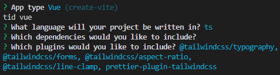

## Installation der Entwicklungsumgebung

Auf dieser Seite wird das Klonen und Einrichten der Entwicklungsumgebung für das Frontend in Visual Studio Code beschrieben.

- [Lokale Einrichtung](#lokale-einrichtung)
- [Initiale Konfiguration](#initiale-konfiguration)
<br/><br/>

## Lokale Einrichtung
In diesem Absatz wird das Klonen und Einrichten der Entwicklungsumgebung für das Frontend beschrieben.
<br/><br/>

#### Vorbereitung
Zunächst muss global `Git`, `Nodejs` und `NPM` installiert werden.
<br/><br/>

#### Klonen des Github Repos
Mit dem folgenden Befehl kann im passenden Ordner das Repo geklont werden.
```bash
git clone https://github.com/Projekt-DataScience/frontend.git
```
<br/><br/>

#### Wechseln in den Projektordner
Als nächstes muss in den Projektordner gewechselt werden.
```bash
cd frontend
```
<br/><br/>

#### Installation von Yarn
Installation von Yarn im Projektordner. Dabei werden automatisch nötige Dependencies installiert.
```bash
npm i yarn
```
<br/><br/>

#### Öffnen von Visual Studio Code
Falls die Anwendung aus der Entwicklungsumgebung gestartet werden soll, kann man mit dem folgenden Befehl VS Code öffnen.
```bash
code .
```
<br/><br/>

#### Starten der Anwendung
Der folgende Befehl startet den Entwicklungsserver und damit die Anwendung.
```bash
yarn run dev
```
<br/><br/>

## Initiale Konfiguration
In diesem Absatz wird die verwendete Konfiguration für das Aufsetzen der Entwicklungsumgebung beschrieben. Diese war nur einmalig für das Aufsetzen erforderlich.
<br/><br/>

#### Vorbereitung
Als Vorbereitung mussten `Yarn`, `Vue` und `Vite` installiert werden.
```bash
npm i yarn
yarn add vite
```
<br/><br/>

#### Erstellen der Vuejs Installation
Mit dem folgenden Befehl kann ein neues Vuejs Projekt erstellt werden mit Vite.
```bash
yarn create tw <project name>
```

Konfiguration von Vite


<br/><br/>

#### Installation von Prettier
Mit dem folgenden Befehl wurde Prettier installiert.
```bash
yarn add --dev prettier
```
<br/><br/>

#### Installation von Vue Router und Vuex
Für die Seitennavigation musste Vue Router installiert werden.
```bash
yarn add vue-router@4
yarn add vuex@next --save
```
<br/><br/>

#### Konfiguration von Vue Router und Vuex
Anschließend müssen einige Projektdateien angepasst werden, damit Vue Router und Vuex funktionieren. Als erstes wird die `main.ts` abgeändert.
```javascript
/* src/main.ts */

import {createApp} from 'vue'
import './style.css'
import App from './App.vue'
import router from './router/index'
import { store } from './store'

createApp(App)
  .use(store)
  .use(router)
  .mount('#app')
```
<br/><br/>

Dann wird die `App.vue` angepasst.
```javascript
/* src/App.vue */

<template>
  <div id="app">
    <router-view />
  </div>
</template>
```
<br/><br/>

Als nächstes wird der Ordner ´views´ und `components` erstellt (sofern nicht vorhanden). Außerdem wird in views die Datei ´Home.vue´ zum testen angelegt.
```javascript
/* src/views/Home.vue */

<template>
    <h1>Home!!</h1>
</template>
```
<br/><br/>

Nun wird der Ordner ´router´ erstellt zusammen mit der Datei ´index.ts´.
```javascript
/* src/router/index.ts */

import { createRouter, createWebHistory } from 'vue-router'
import Home from '/src/views/Home.vue'
const routes = [
    {
        path: '/',
        name: 'Home',
        component: Home,
    },
]
const router = createRouter({
    history: createWebHistory(),
    routes,
})
export default router
```
<br/><br/>

Anschließend wird der Ordner ´store´ erstellt zusammen mit der Datei ´index.ts´ und ´types.ts´
```javascript
/* src/store/index.ts */

import { createStore } from 'vuex'
import { RootState } from "./types";

export const store = createStore({
  state () {
    return {
      count: 1
    }
  }
})
```
```javascript
/* src/store/types.ts */

export interface RootState {}
```
<br/><br/>
