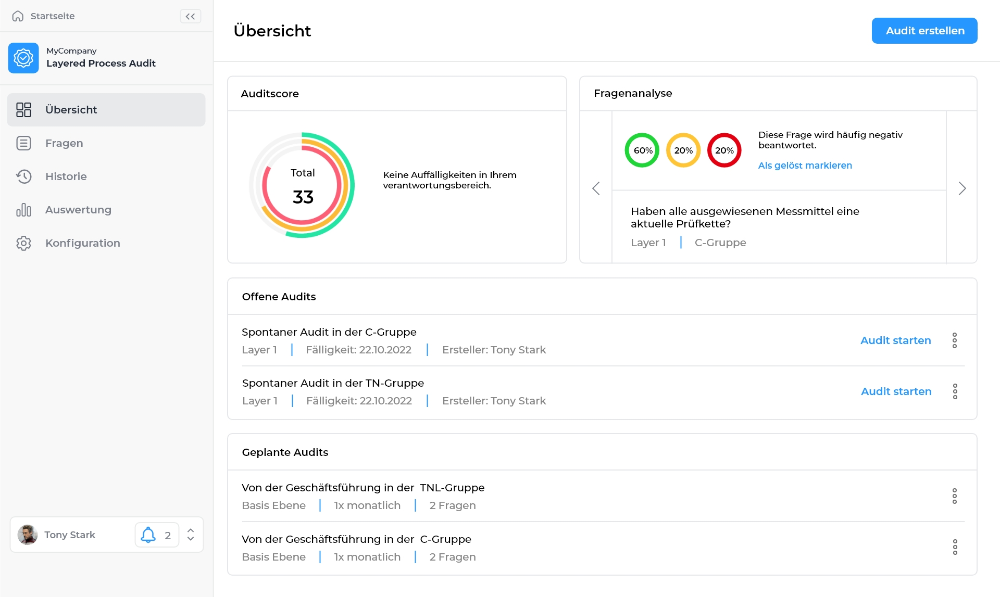

# Mockup
Hier visualisieren wir die grobe Designplanung des Frontends als Mockup. Das Mockup wurde in Adobe XD erstellt und besteht aus Screenshots.

## Login

## Dashboard
Das Dashboard fasst die einzelnen Anwendungen zusammen. Wir haben hier auch Anwendungen eingeblendet, die wir nicht umsetzen um die zukünftige Plattform zu visualisieren. Die Funktion "Lizenz erwerben" setzen wir nicht um.

## Übersicht
Die Übersicht wird angezeigt, sobald der Nutzer im Dashboard die LPA-App auswählt.

## Spontaner Audit erstellen
Sobald in der Übersicht auf den Button "Audit erstellen" geklickt wird, wird der folgende Popup eingeblendet.

## Audit durchführen
Sobald auf Audit starten geklickt wird in den Aufgaben (oder auf der Übersicht-Seite) wird die folgende Seite angezeigt.

#### Frage beantworten
Im Detail wird dann jede Frage wie in der folgenden Ansicht beantwortet. Nur bei Rot wird ein Kommentarfeld eingeblendet.

## Fragen
Die folgende Seite visualisiert alle Fragen.

#### Neue Frage
Auf der folgenden Seite kann man eine neue Frage hinzufügen.

## Historie
Die folgende Seite visualisiert die bereits durchgeführten Audits.

#### Detail-Ansicht
Die folgende Seite zeigt einen Audit im Detail.

#### Navigation-Zugeklappt
Die Navigation soll zugeklappt werden können.

## Konfiguration
Die Konfiguration besteht aus den Einstellungen zum Layer und der Gruppen.

#### Gruppeneinstellung
Die folgende Seite soll die Gruppeneinstellung visualisieren.

#### Darkmode
Die Seite soll nach Möglichkeit auch in den Darkmode wechseln.

## Auswertung
Die Auswertungsseite ist aktuell noch nicht fertig. Zwischenstand:

